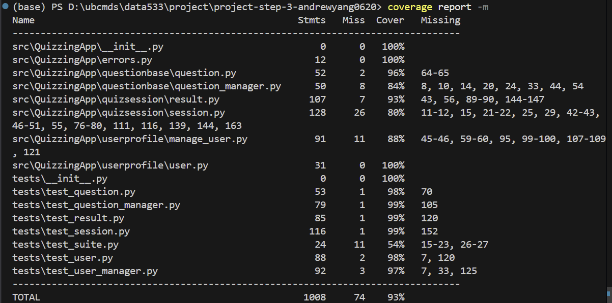

# Quizzing App DATA533

Group 3 Mebmers: ***Jingtao Yang***, ***Yiran Wang***, ***Zihao Zhao***

[**Project Presentation Video**](https://youtu.be/oRUMw0Y-9w0)

Our project is designed to be a Quizzing App that supports the full lifecycle of quiz creation, user management, quiz execution, scoring, and visualization. 

**The key features are:**

1. Question Creation & Management - supports multiple question types (MCQ, TF, SA) and includes functions to store, modify, and organize questions.
2. User (Quiz-Taker) Profile - support regular/prenium users, for creation/management of user profiles and manage past quiz scores
3. Quiz Session Excution - generate custimized quizzes with certain types of questions, manage question flow and get answer from quiz-takers
4. Quiz Scoring and Result Visulization - Compare answers from the quiz-taker and get the scores, create visualization of the result

The core app components are divided into 3 subpackages, and each of the subpackages has two or three modules for achieving the functions.

## General Structure
```
QuizzingApp/
├── README.md
├── .github/
│   └── workflows/
│       └── main.yml
├── pyproject.toml
├── LICENSE
├── MANIFEST.in
├── coverage.ini
├── docs/
│   ├── project_description.pdf
│   └── coverage_report.png           # coverage report screenshot
│
├── src/
│   └── QuizzingApp/
│       ├── __init__.py
│       ├── __main__.py
│       │
│       ├── questionbase/             # sub-package 1
│       │   ├── __init__.py
│       │   ├── question.py
│       │   └── question_manager.py
│       │
│       ├── userprofile/              # subpackage 2
│       │   ├── __init__.py
│       │   ├── user.py
│       │   └── user_manager.py
│       │
│       ├── quizsession/              # sub-package 3
│       │   ├── __init__.py
│       │   ├── session.py
│       │   └── result.py
│       │
│       └── data/
│           ├── questions.json
│           ├── users.json
│           └── sessions.json
│
├── tests/
│   ├── __init__.py
|   ├── test_suite.py
│   ├── other unit test files...
│
└── .gitignore 
```

## Testing Coverage
This project includes automated unittests written using `unittest`, which covers all App modules. The `test_suite.py` combines all the test and run at once. 

The test coverage is measured using the `coverage.py` tool. We add a coverage.ini file to ensure the converted coverage percentage excludes files in `test/` folder.

We have achieved **93%** total coverage. The coverage report screenshot is below:



Here are the code for the test coverage:
```bash
coverage run -m pytest
coverage report
```

## Installation
1. **Clone the repository:**
   ```bash
   git clone https://github.com/ubco-mds-2025-labs/project-step-3-andrewyang0620.git
   cd project-step-3-andrewyang0620
   ```


2. **Install required packages:**
   ```bash
   pip install matplotlib numpy
   ```

## How to Use
### Running the Application
After direct to `project-step-3-andrewyang0620`, excute the following:
```bash
cd src
python -m QuizzingApp
```
The application will display an interactive menu system. Simply follow the on-screen instructions:

1. **Main Menu**: Choose between User or Admin mode, or quit
   - Enter `1` for User functions
   - Enter `2` for Admin functions
   - Enter `q` to quit

2. **Follow the prompts**: The application will guide you through each step
   - Select options by entering the corresponding number
   - Enter `q` at any menu to return to the previous screen

3. **User Mode**:
   - Register a new user profile
   - Create a quiz session and participate in it.

4. **Admin Mode**:
   - Add new questions
   - View all existing questions
   - Delete all questions
   - View all users
   - Delete all users

## Package Function Details
### Sub-package 1: userprofile/
### *user.py*
- `__init__(self, user_id, name, age, email, grades=None, profile_level="regular")` Initializes a basic User object.
- `setUserInfo(self, name=None, age=None, email=None)` Updates personal information.
Only fields passed as non-None values will be updated.
- `getUserInfo(self)` Returns a dictionary containing full user profile information.
- `user_id, name, age, email, grades (list of numbers), profile_level (regular / premium)` Used when exporting profile data or showing user details.
- `addScore(self, score)` Adds a new quiz score to the user’s grade list.
- `getAvg(self)` Returns the user’s average score across all recorded quizzes. If the user has no grades yet, returns 0.0.
- `toDict(self)` Converts the user’s information into a dictionary for JSON saving.

-  Class: `RegularUser(User)` `__init__(self, user_id, name, age, email, grades=None` Initializes a RegularUser object. `profile_level = "regular"` Automatically sets in this.

- Class: `PremiumUser(User)``__init__(self, user_id, name, age, email, grades=None)` Initializes a PremiumUser object. `profile_level = "premium"` Automatically sets in this.


### *manage_user.py*
- `createUser(user_type, user_id, name, age, email, grades=None)` Creates a new user object based on the given user type.
- `user_type == "regular"` creates a RegularUser
- `user_type == "premium"` creates a PremiumUser

- `deleteUser(user_id)` Deletes a user from internal memory if its ID exists.
- `True` If deletion succeeds
- `False` If user does not exist

- `getUser(user_id)` Returns the user object with the matching ID.
- `None` If not found

- `getAllUsers()` Returns a list of all user objects currently stored in memory.

- `deleteAllUsers()` Clears all users from memory by resetting the global `_users` dictionary.

- `toJson(filepath=USERS_JSON)` Saves all current users to a JSON file located at `filepath.`

- `getJson(filepath=USERS_JSON)` Loads user data from a JSON file and rebuilds the correct objects.

- `registerUser(filepath=USERS_JSON)` Interactive console-based user registration process.

### Sub-package 2: questionbase/
### *question.py*
#### Class: Question
- `__init__(self, qid, qtext, qanswer, qtopic, qdifficulty, qtype)` Initializes a basic question object.
- `setText(self, new_text)`
Updates the text/content of the question.
- `setAnswer(self, new_answer)`
Changes the correct answer stored for the question.
- `setTopic(self, new_topic)`
Updates the topic/category of the question.
- `setType(self, new_type)`
Updates the question type (MCQ to SA).
- `getText(self)`
Returns the question text.
- `getAnswer(self)`
Returns the correct answer.
- `getTopic(self)`
Returns the topic/category.
- `getType(self)`
Returns the question type.
- `display(self)`
Returns a formatted string representing: question ID, question text, topic, difficulty, type.
Used for printing/previewing questions in console.
- `checkAnswer(self, user_input)`
Checks whether the user’s input matches the correct answer.

- `toDict(self)`
Converts the object into a dictionary for JSON saving.

- Class: `MCQuestion(Question)` Inherits from Question. Represents a multiple-choice question.

- Class: `TFQuestion(Question)` Inherits from Question. Represents a True/False question.

- Class: `SAQuestion(Question)` Inherits from Question. Represents a short-answer question.

### *Question_manager.py*
#### Class: QuestionManager
This class is responsible for loading, storing, filtering, adding, and saving questions.
It acts as the controller between question objects and JSON storage.
- `__init__(self)` Initializes an empty list: `self.questions = []`. This list will store question objects (Question, MCQuestion, TFQuestion, or SAQuestion).

- `addQuestion(self, question_obj)` Adds a question object into the internal list.

- `deleteQuestion(self, qid)` Removes the question with a matching question ID. Implementation uses list comprehension: `self.questions = [q for q in self.questions if q.qid != qid]` If the ID does not exist, nothing happens.
- `getAllQuestions(self)` Returns the full list of question objects currently stored in memory.Often used when: Admin wants to display all questions, and quiz system needs the pool to randomly pick questions
- `filterQuestions(self, qtype)` Returns only the questions whose q.qtype == qtype.
- `toJson(self, filepath)` Saves all current question objects to a JSON file.

- `getJson(self, filepath)` Loads questions from a JSON file and rebuilds the correct Python objects.

### Sub-package 3: quizsession/
### *session.py*
- `loadAllQuestions(json_file_path)` Loads all questions from the questions.json file. Returns a list of question dictionaries.

- `loadUsers(json_file_path)` Loads all users from the users.json file

- `selectUser(users)` Prompts user to login by entering their name

- `showQuestions(questions)` Displays a list of question IDs and titles for preview purposes.

- `pickQuestions(all_questions, num_questions)` Randomly selects a specified number of questions by type

- `createSession(user_id, user_name, num_questions, question_ids)` Creates and returns a new QuizSession instance.

#### Class: QuizSession
- `__init__(user_id, user_name, num_questions, question_ids)` Initializes a quiz session with user information and selected question IDs. Generates a unique session_id using UUID.

- `startSession()` Records the start time and displays a welcome message to the user.

- `askQuestions(all_questions)` Displays each question interactively and collects user answers. Appends each answer as a tuple.

- `getCurrentQuestion()` Returns the current question object based on current_index.

- `nextQuestion()` Advances to and returns the next question.

- `submitAnswer(answer)` Records the user's answer for the current question and increments the index.

- `endSession()` Records the end time, sets isFinished to True, and displays a completion message.

- `culculateTime()` Calculates and returns the total time spent on the quiz in seconds.

- `toDict()` Converts session data to a dictionary format for serialization and result analysis.

### *result.py*
#### Class: QuizResult
- `__init__(session_dict, all_questions)` Initializes result analysis from completed session data. Extracts session info and matches questions with user answers. Calls `_analyze_answers()` to process results.

- `_analyze_answers()` Internal method that compares each user answer with the correct answer and builds a results list containing question details, user answer, correct answer, correctness status, and question type.

- `compareAnswer(question, answer)` Checks if the user's answer matches the correct answer. Performs case-insensitive string comparison for text answers.

- `countCorrect()` Returns the number of correct answers.

- `countWrong()` Returns the number of incorrect answers.

- `getScore()` Returns the score (same as countCorrect).

- `percentage()` Calculates and returns the percentage score rounded to 2 decimal places.

- `typeChart()` **Premium Feature** - Displays a pie chart showing the distribution of question types attempted in the quiz.

- `typeCorrectBar()` **Premium Feature** - Displays a bar chart comparing correct vs incorrect answers for each question type.

- `toDict()` Converts result data to a dictionary format for saving.

- `toJSON()` Converts result data to a formatted JSON string.

- `saveResult(filepath)` Saves the quiz result to the sessions.json file

## Data Storage
All data is stored in JSON format in the `data/` directory:
- **users.json**: User profiles
- **questions.json**: All quiz questions
- **sessions.json**: Quiz results
